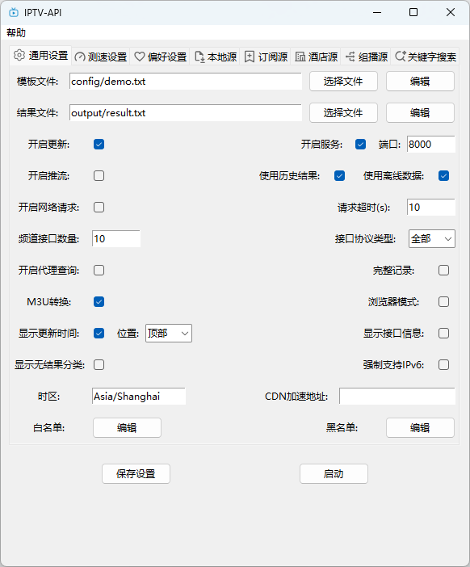

<div align="center">
  
  <h1 align="center">IPTV-API</h1>
</div>

<div align="center">Customize channels, automatically obtain live source interface, and generate usable results after speed test</div>
<div align="justify">Default results include: 📺CCTV Channel, 💰CCTV Pay Channel, 📡Satellite TV Channel, 🏠Guangdong Channel, 🌊Hong Kong · Macao · Taiwan Channel, 🎬Movie Channel, 🎥Migu Live Streaming, 🏀Sports Channel, 🪁Animation channel, 🎮Game channel, 🎵Music channel, 🏛Classic Theater.</div>

<details>
  <summary>Specific channel</summary>
  <div>
  📺CCTV Channel: CCTV-1, CCTV-2, CCTV-3, CCTV-4, CCTV-5, CCTV-5+, CCTV-6, CCTV-7, CCTV-8, CCTV-9, CCTV-10, CCTV-11, CCTV-12, CCTV-13, CCTV-14, CCTV-15, CCTV-16, CCTV-17, CETV1, CETV2, CETV4, CETV5
  </div>
  <br>
  <div>
  💰CCTV Pay Channel: 文化精品, 央视台球, 风云音乐, 第一剧场, 风云剧场, 怀旧剧场, 女性时尚, 高尔夫网球, 风云足球, 电视指南, 世界地理, 兵器科技
  </div>
  <br>
  <div>
  📡Satellite TV Channel: 广东卫视, 香港卫视, 浙江卫视, 湖南卫视, 北京卫视, 湖北卫视, 黑龙江卫视, 安徽卫视, 重庆卫视, 东方卫视, 东南卫视, 甘肃卫视, 广西卫视, 贵州卫视, 海南卫视, 河北卫视, 河南卫视, 吉林卫视, 江苏卫视, 江西卫视, 辽宁卫视, 内蒙古卫视, 宁夏卫视, 青海卫视, 山东卫视, 山西卫视, 陕西卫视, 四川卫视, 深圳卫视, 三沙卫视, 天津卫视, 西藏卫视, 新疆卫视, 云南卫视
  </div>
  <br>
  <div>
  ☘️Guangdong Channel: 广东珠江, 广东体育, 广东新闻, 广东民生, 广东卫视, 大湾区卫视, 广州综合, 广州影视, 广州竞赛, 江门综合, 江门侨乡生活, 佛山综合, 深圳卫视, 汕头综合, 汕头经济, 汕头文旅, 茂名综合, 茂名公共
  </div>
  <br>
  <div>
  ☘️Local channels in each province
  </div>
  <br>
  <div>
  🌊Hong Kong · Macao · Taiwan Channel: 翡翠台, 明珠台, 凤凰中文, 凤凰资讯, 凤凰香港, 凤凰卫视, TVBS亚洲, 香港卫视, 纬来体育, 纬来育乐, J2, Viutv, 三立台湾, 无线新闻, 三立新闻, 东森综合, 东森超视, 东森电影, Now剧集, Now华剧, 靖天资讯, 星卫娱乐, 卫视卡式
  </div>
  <br>
  <div>
  🎬Movie Channel: CHC家庭影院, CHC动作电影, CHC高清电影, 淘剧场, 淘娱乐, 淘电影, NewTV惊悚悬疑, NewTV动作电影, 黑莓电影, 纬来电影, 靖天映画, 靖天戏剧, 星卫娱乐, 艾尔达娱乐, 经典电影, IPTV经典电影, 天映经典, 无线星河, 星空卫视, 私人影院, 东森电影, 龙祥电影, 东森洋片, 东森超视
  </div>
  <br>
  <div>
  🎥Migu Live Streaming: 咪咕直播1-45
  </div>
  <br>
  <div>
  🏀Sports Channel: CCTV-5, CCTV-5+, 广东体育, 纬来体育, 五星体育, 体育赛事, 劲爆体育, 爱体育, 超级体育, 精品体育, 广州竞赛, 深圳体育, 福建体育, 辽宁体育, 山东体育, 成都体育, 天津体育, 江苏体育, 安徽综艺体育, 吉林篮球, 睛彩篮球, 睛彩羽毛球, 睛彩广场舞, 风云足球, 足球频道, 魅力足球, 天元围棋, 快乐垂钓, JJ斗地主
  </div>
  <br>
  <div>
  🪁Animation channel: 少儿动画, 卡酷动画, 动漫秀场, 新动漫, 青春动漫, 爱动漫, 中录动漫, 宝宝动画, CN卡通, 优漫卡通, 金鹰卡通, 睛彩少儿, 黑莓动画, 炫动卡通, 24H国漫热播, 浙江少儿, 河北少儿科教, 七龙珠, 火影忍者, 海绵宝宝, 中华小当家, 斗破苍穹玄幻剧, 猫和老鼠, 经典动漫, 蜡笔小新, 漫画解说
  </div>
  <br>
  <div>
  🎮Game channel: 游戏风云, 游戏竞技, 电竞游戏, 海看电竞, 电竞天堂, 爱电竞
  </div>
  <br>
  <div>
  🎵Music channel: CCTV-15, 风云音乐, 音乐现场, 音乐之声, 潮流音乐, 天津音乐, 音乐广播, 音乐调频广播
  </div>
  <br>
  <div>
  🏛Classic Theater: 笑傲江湖, 天龙八部, 鹿鼎记, 仙剑奇侠传, 西游记, 三国演义, 水浒传, 新白娘子传奇, 天龙八部, 济公游记, 封神榜, 闯关东, 上海滩, 射雕英雄传
  </div>
</details>
<br>
<p align="center">
  <a href="https://github.com/Guovin/iptv-api/releases/latest">
    
  </a>
  <a href="https://www.python.org/">
    
  </a>
  <a href="https://github.com/Guovin/iptv-api/releases/latest">
    
  </a>
  <a href="https://hub.docker.com/repository/docker/guovern/iptv-api">
    
  </a>
  <a href="https://hub.docker.com/repository/docker/guovern/tv-requests">
    
  </a>
  <a href="https://hub.docker.com/repository/docker/guovern/tv-driver">
    
  </a>
  <a href="https://github.com/Guovin/iptv-api/fork">
    
  </a>
</p>

[中文](./README.md) | English

- [✅ Features](#features)
- [🔗 Latest results](#latest-results)
- [⚙️ Config parameter](./docs/config_en.md)
- [🚀 Quick Start](#quick-start)
- [📖 Detailed Tutorial](./docs/tutorial_en.md)
- [🗓️ Changelog](./CHANGELOG.md)
- [❤️ Appreciate](#appreciate)
- [👀 Follow](#follow)
- [📣 Disclaimer](#disclaimer)
- [⚖️ License](#license)

## Features

- ✅ Customize the template to generate the channel you want
- ✅ Supports multiple source acquisition methods: multicast source, hotel source, subscription source, keyword search
- ✅ Interface speed testing and verification, with priority on response time and resolution, filtering out ineffective interfaces
- ✅ Preferences: IPv6, priority and quantity of interface source sorting, and interface whitelist
- ✅ Scheduled execution at 6:00 AM and 18:00 PM Beijing time daily
- ✅ Supports various execution methods: workflows, command line, GUI software, Docker(amd64/arm64/arm v7)
- ✨ For more features, see [Config parameter](./docs/config_en.md)

## Latest results

- Interface source:

```bash
https://ghp.ci/raw.githubusercontent.com/skzcd/tv-zby/master/output/result.m3u
```

```bash
https://ghp.ci/raw.githubusercontent.com/skzcd/tv-zby/master/output/result.txt
```

- Data source:

```bash
https://ghp.ci/raw.githubusercontent.com/skzcd/tv-zby/master/output/result.json
```

## Config

[Config parameter](./docs/config_en.md)

## Quick Start

### Method 1: Workflow

Fork this project and initiate workflow updates, detailed steps are available at [Detailed Tutorial](./docs/tutorial_en.md)

### Method 2: Command Line

```python
pip install pipenv
```

```python
pipenv install --dev
```

Start update:

```python
pipenv run dev
```

Start service:

```python
pipenv run service
```

### Method 3: GUI Software

1. Download [IPTV-API update software](https://github.com/Guovin/iptv-api/releases), open the software, click update to complete the update

2. Or run the following command in the project directory to open the GUI software:

```python
pipenv run ui
```



### Method 4: Docker

- iptv-api (Full version): Higher performance requirements, slower update speed, high stability and success rate. Set open_driver = False to switch to the lite running mode (recommended for hotel sources, multicast sources, and online searches)
- iptv-api:lite (Condensed version): Lightweight, low performance requirements, fast update speed, stability uncertain (recommend using this version for the subscription source)

It's recommended to try each one and choose the version that suits you

1. Pull the image:

- iptv-api

```bash
docker pull guovern/iptv-api:latest
```

- iptv-api:lite

```bash
docker pull guovern/iptv-api:lite
```

2. Run the container:

- iptv-api

```bash
docker run -d -p 8000:8000 guovern/iptv-api
```

- iptv-api:lite

```bash
docker run -d -p 8000:8000 guovern/iptv-api:lite
```

Volume Mount Parameter (Optional):
This allows synchronization of files between the host machine and the container. Modifying templates, configurations, and retrieving updated result files can be directly operated in the host machine's folder.

Taking the host path /etc/docker as an example:

- iptv-api：

```bash
docker run -v /etc/docker/config:/iptv-api/config -v /etc/docker/output:/iptv-api/output -d -p 8000:8000 guovern/iptv-api
```

- iptv-api:lite：

```bash
docker run -v /etc/docker/config:/iptv-api-lite/config -v /etc/docker/output:/iptv-api-lite/output -d -p 8000:8000 guovern/iptv-api:lite
```

3. Update results:

- API address: ip:8000
- M3u api：ip:8000/m3u
- Txt api：ip:8000/txt
- API content: ip:8000/content
- Speed test log: ip:8000/log

## Changelog

[Changelog](./CHANGELOG.md)

## Appreciate

<div>Development and maintenance are not easy, please buy me a coffee ~</div>

| Alipay                                | Wechat                                    |
| ------------------------------------- | ----------------------------------------- |
|  |  |

## Follow

Wechat public account search for Govin, or scan the code to receive updates and learn more tips:


## Disclaimer

This project is for learning and communication purposes only. All interface data comes from the internet. If there is any infringement, please contact us for removal.

## License

[MIT](./LICENSE) License &copy; 2024-PRESENT [Govin](https://github.com/guovin)
